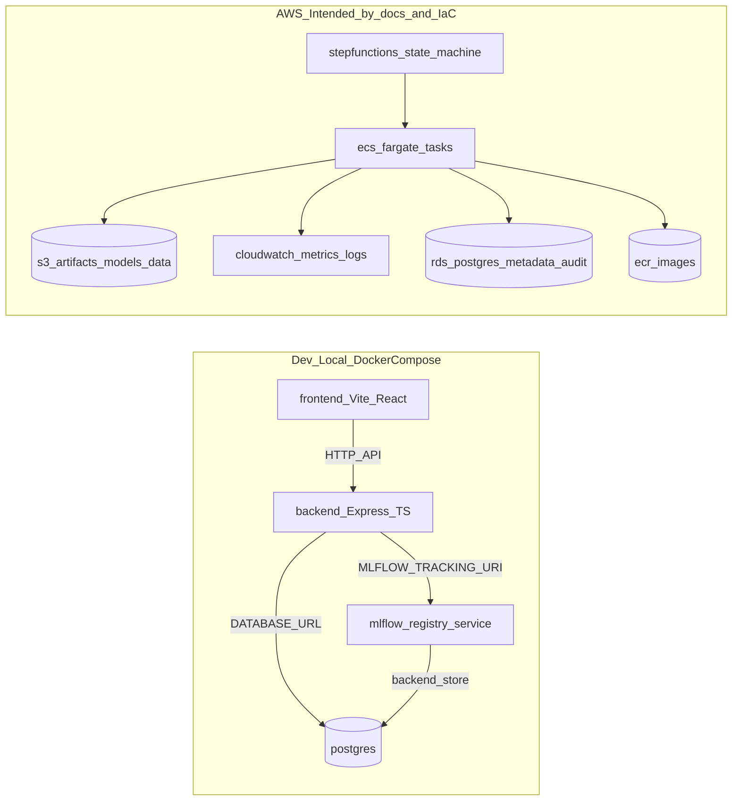

# End-to-end flow (current vs target)

This document is a **developer map** for how the repo implements (or intends to implement) the lifecycle:

**Train → Track/Registry → Promote → Deploy → Serve → Monitor → Govern (CI/CD + audit)**.

It also calls out **what is currently simulated** vs **what is wired end-to-end**.

## System diagram (current codebase)

## Flow trace with file mapping

### 1) Train (example)
- **Example training script**: `scripts/example-train-model.sh`
  - Trains a sample model and logs to MLflow.

**Status today**: present as a demo script; training pipeline stages are described for AWS but not fully implemented as runnable container tasks in this repo.

### 2) Track + Registry (MLflow)
- **Registry service**: `model-registry/app.py`
- **Registry config**: `model-registry/config.py`
- **Local wiring**: `docker-compose.yml` (`mlflow` service + Postgres backend store + artifact root volume)

**Status today**: MLflow registry/tracking is runnable locally via Compose.

### 3) Promote (dev → staging → prod)
- **MLflow stage transitions**: `model-registry/app.py` (promote endpoint uses MLflow registry APIs)
- **Control plane promotion API (simulated)**: `backend/src/app.ts` (`POST /api/models/:id/promote` updates in-memory model state)

**Status today**: promotion is implemented in two disconnected ways:
- MLflow registry can promote versions/stages.
- Backend can “promote” by mutating in-memory state (not persisted).

### 4) Deploy (create an endpoint)
- **Control plane deployment API (simulated)**: `backend/src/app.ts` (`POST /api/deployments` synthesizes ECS ARNs and stores in-memory)
- **AWS intended CI/CD**: `cicd/deploy-to-dev.yml`, `cicd/promote-to-prod.yml` (present but not active until moved to `.github/workflows/`)
- **AWS IaC**: `infra/*.tf` and `pipelines/canonical-pipeline.json` (Step Functions state machine)

**Status today**: deployment is not materially wired to a runtime (ECS/K8s). It is currently bookkeeping + intended workflows/IaC.

### 5) Serve (inference runtime)
- **Inference service**: `model-serving/inference_server.py`
  - Loads model from `MODEL_PATH` (defaults to `/models`) using `mlflow.pyfunc.load_model`.

**Status today**: serving can run, but the **model must already exist** at `MODEL_PATH` inside the container (baked, mounted, or downloaded manually).

### 6) Monitor (drift + health)
- **Drift detection logic**: `monitoring/drift_detection.py`
- **Backend monitoring endpoints (simulated)**: `backend/src/app.ts` returns randomized drift/alerts.

**Status today**: drift code exists, but the monitoring loop is not integrated into a scheduler/runtime and backend results are simulated.

### 7) Govern (CI/CD, approvals, audit)
- **GitHub Pages deploy (active)**: `.github/workflows/deploy-to-pages.yml`
- **Other workflows (inactive until moved)**: `cicd/*.yml`
- **Audit log (simulated)**: `backend/src/app.ts` stores audit logs in-memory; DB schemas exist in `scripts/init-db.sh`.

**Status today**: governance controls exist in docs/UI, but enforcement is not end-to-end (approvals + audit persistence).

## Key gaps to close (why the prototype isn’t “enterprise-grade” yet)

1) **Control plane persistence**: backend state is in-memory (`backend/src/app.ts`) while Postgres exists in Compose.\n
2) **Promotion → deployment materialization**: serving loads `MODEL_PATH`, but there is no automated step to fetch the promoted MLflow model into serving.\n
3) **CI/CD enforcement**: workflows in `cicd/` are not running as GitHub Actions; approvals are not GitHub Environment-gated.\n
4) **Auth/RBAC**: roles are described, but there’s no real authentication/authorization layer.\n
5) **Observability**: metrics/logs are placeholder rather than standardized (OpenTelemetry/Prometheus).\n

The implementation work in the remaining todos focuses on closing these gaps while preserving the current UI flows.

